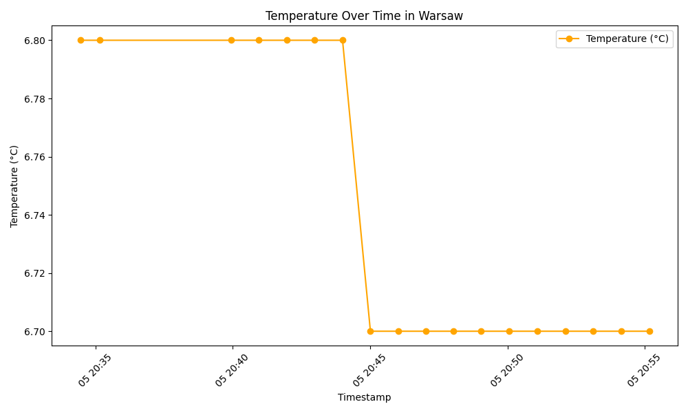

# My First Etl Pipeline

## Description
Simple ETL pipeline using Pandas which loads data from weather api, saves it to a postgres database, and visualizes it using matplotlib.

## Technologies Used
- Python
- Pandas
- Matplotlib
- PostgreSQL
- SQLAlchemy
- Requests
- Docker Compose
- Uv

## Beautiful Visualizations

